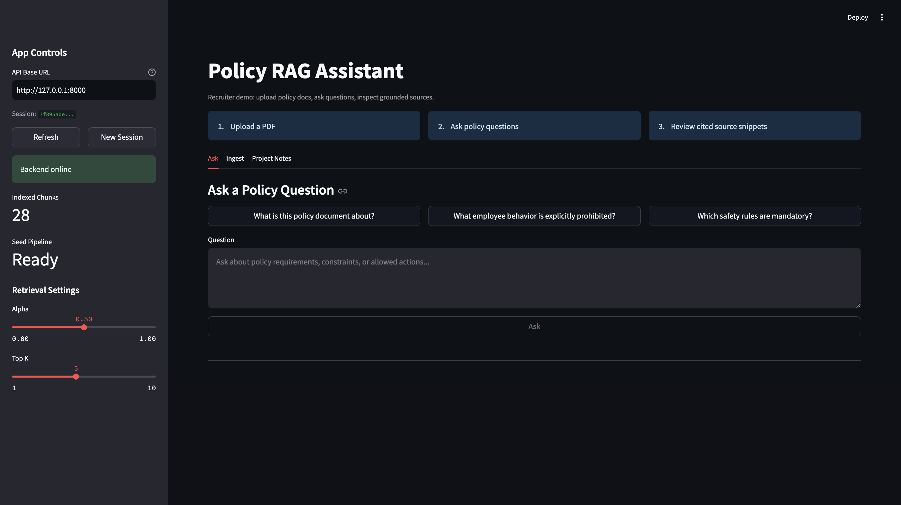
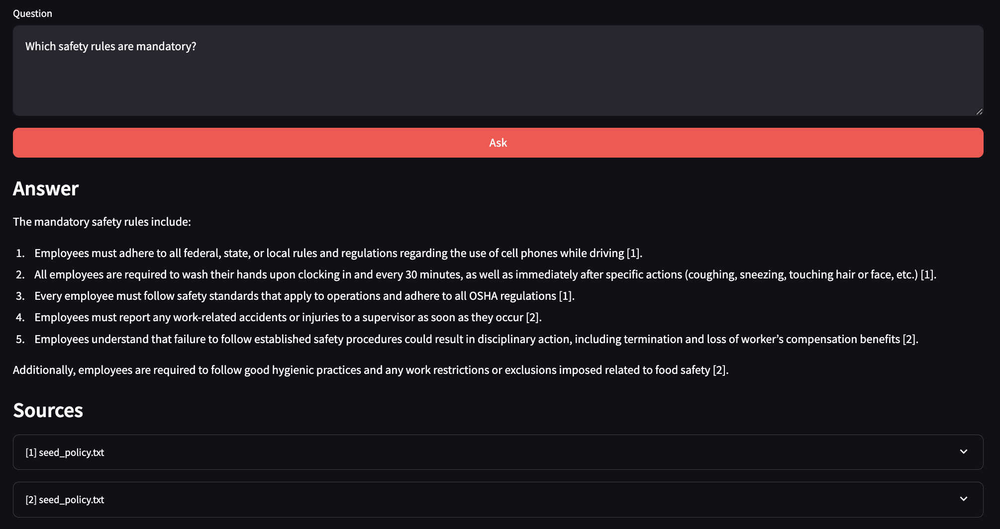
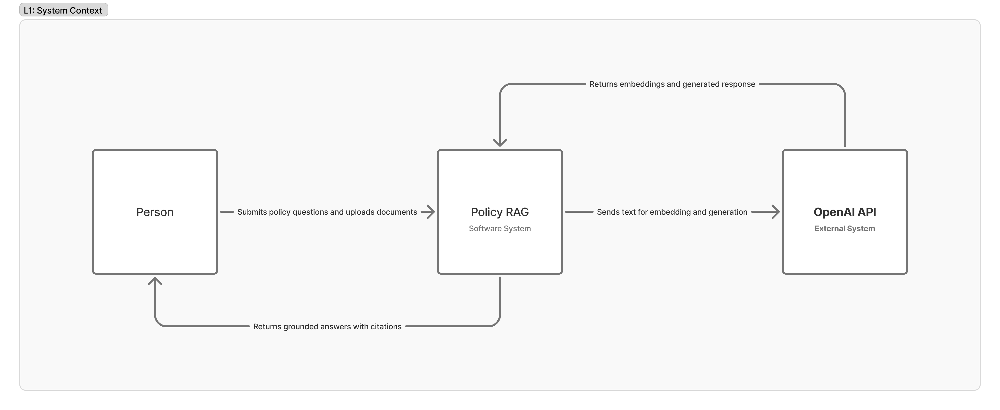
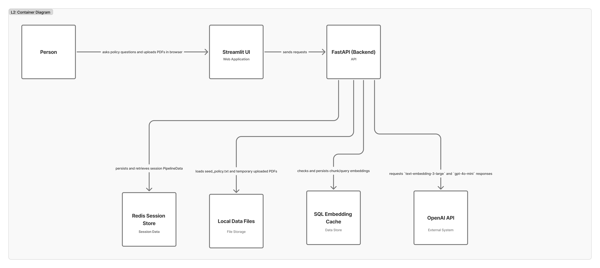
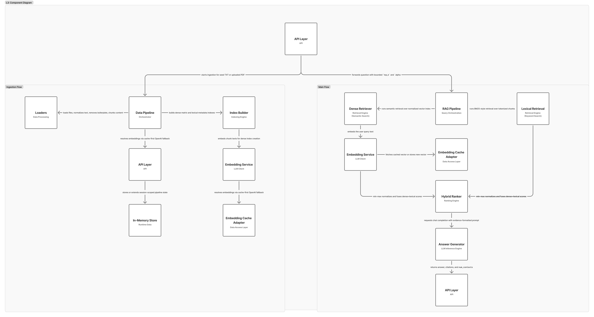

# Policy RAG App

[](https://github.com/BohdanChuprynka/Policy-RAG/actions/workflows/ci.yml)

A hybrid Retrieval-Augmented Generation (RAG) assistant that turns policy documents into a practical decision tool — ask a question in plain language, get a grounded, citation-backed answer.

---

## Demo





---

## System Architecture (C4)

### L1 — System Context



### L2 — Container



### L3 — Component (FastAPI Backend)



> Full C4 documentation: [`docs/architecture/c4-rag-architecture.md`](docs/architecture/c4-rag-architecture.md)

---

## Why This Exists

New hires and frontline teams lose time when policy answers are buried in long documents. This project solves that:

- **Speed** — instant, grounded answers instead of manual document search.
- **Consistency** — reduces divergent policy interpretation across teams.
- **Traceability** — every claim cites the source paragraph, so answers are auditable.

---

## Tech Stack

| Layer | Technology |
|-------|-----------|
| Backend API | FastAPI, Uvicorn |
| Frontend | Streamlit |
| LLM / Embeddings | OpenAI SDK (`gpt-4o-mini`, `text-embedding-3-large`) |
| Retrieval | NumPy (dense cosine), BM25 (lexical), weighted fusion |
| Session State | Redis (async, with sliding-window TTL) |
| Embedding Cache | SQLite |
| Packaging | `uv` lockfile, multi-stage Docker |
| CI | GitHub Actions, pytest |

---

## Repository Structure

```
src/
  policy_app/
    api.py                        # FastAPI endpoints (health, query, ingest)
    config.py                     # Pydantic settings from env / .env
    models.py                     # Shared Pydantic models
    ingest/
      loaders.py                  # TXT / PDF chunking + boilerplate removal
      index_build.py              # Dense + lexical index construction
    retrieval/
      dense.py                    # Embedding cosine-similarity retrieval
      lexical.py                  # BM25-like lexical retrieval
      hybrid.py                   # Score normalization + weighted fusion
    llm/
      embedding.py                # OpenAI embedding client + L2 normalization
      generate.py                 # Answer generation with citation extraction
    storage/
      session_store.py            # Redis-backed session persistence
      embedding_cache.py          # SQLite embedding cache
    pipelines/
      data_pipeline.py            # Build / extend pipeline artifacts
      rag_pipeline.py             # End-to-end retrieval + generation
    utils/
      text.py                     # Tokenization, whitespace, boilerplate utils
  frontend/
    streamlit_app.py              # Full demo UI (with PDF ingest)
    streamlit_recruiter_app.py    # Public-safe recruiter demo

tests/                            # pytest suite (fakeredis, no real API calls)
data/                             # Seed policy document
Railway/                          # Railway cloud deployment (Dockerfiles + guide)
```

---

## Quick Start

### 1. Clone

```bash
git clone https://github.com/BohdanChuprynka/Policy-RAG.git
cd Policy-RAG
```

### 2. Install

```bash
python -m venv .venv && source .venv/bin/activate
pip install -e .
```

### 3. Configure

```bash
cp .env.example .env
# Set OPENAI_API_KEY in .env
```

### 4. Start Redis + Backend

```bash
docker compose up redis -d          # managed Redis
uvicorn policy_app.api:app --app-dir src --reload --port 8000
```

### 5. Launch Frontend

```bash
streamlit run src/frontend/streamlit_app.py
```

---

## Docker Compose (Local)

Starts the full stack — Redis, FastAPI backend, and Streamlit frontend:

```bash
cp .env.example .env
# edit OPENAI_API_KEY
docker compose up --build
```

| Service | Port | Description |
|---------|------|-------------|
| `redis` | 6379 | Session state (Redis 7 Alpine) |
| `backend` | 8000 | FastAPI API server |
| `streamlit` | 8501 | Streamlit frontend |

---

## Railway Deployment

The [`Railway/`](Railway/) folder contains production Dockerfiles and a step-by-step setup guide.

**TL;DR:** Create 3 services in one Railway project:

1. **Redis** — add as a Railway database plugin (managed, no Dockerfile)
2. **Backend** — deploy with `Railway/Dockerfile.backend`, reference `REDIS_URL` from the Redis plugin
3. **Frontend** — deploy with `Railway/Dockerfile.frontend`, set `API_BASE_URL` to the backend's domain

Full instructions: [`Railway/SETUP.md`](Railway/SETUP.md)

---

## Configuration

All settings live in [`src/policy_app/config.py`](src/policy_app/config.py) and are configurable via environment variables or `.env`.

| Variable | Default | Description |
|----------|---------|-------------|
| `OPENAI_API_KEY` | *(required)* | OpenAI API key |
| `REDIS_URL` | `redis://localhost:6379/0` | Redis connection string |
| `SEED_POLICY_TXT` | `data/seed_policy.txt` | Path to seed policy file |
| `ALLOW_PDF_INGEST` | `false` | Enable PDF upload endpoint |
| `EMBEDDING_CACHE_ENABLED` | `true` | Cache embeddings in SQLite |
| `ALPHA` | `0.5` | Dense vs. lexical weight (1.0 = dense only) |
| `HYBRID_TOPK` | `5` | Number of chunks for generation |
| `MODEL_NAME` | `gpt-4o-mini` | OpenAI chat model |
| `EMBED_MODEL` | `text-embedding-3-large` | OpenAI embedding model |

---

## API Reference

### `GET /health`

```json
{ "ok": true, "num_sessions": 1, "has_seed": true, "total_chunks": 42 }
```

### `POST /query?question=...&top_k=5&alpha=0.5`

Header: `X-Session-ID` (optional — for session-scoped context)

```bash
curl -X POST "http://localhost:8000/query?question=What+is+prohibited" \
  -H "X-Session-ID: my-session"
```

### `POST /ingest/pdf`

Requires `ALLOW_PDF_INGEST=true`. Multipart file upload.

```bash
curl -X POST "http://localhost:8000/ingest/pdf" \
  -H "X-Session-ID: my-session" \
  -F "file=@data/McDonalds_Policy.pdf"
```

---

## Testing

```bash
# Run all tests (no OpenAI calls — uses fakeredis + monkeypatching)
pytest -q

# Same command used in CI
OPENAI_API_KEY=test-key pytest -q
```

Test coverage includes: API endpoints, Pydantic models, BM25 scoring, hybrid fusion, score normalization, text utilities, session serialization, seed loader, and index construction.

---

## Troubleshooting

| Problem | Fix |
|---------|-----|
| `OPENAI_API_KEY` missing | Ensure `.env` exists with a valid key |
| Backend unreachable in Streamlit | Start API server; verify `API_BASE_URL` |
| PDF ingest returns 403 | Set `ALLOW_PDF_INGEST=true` |
| "No documents ingested yet" | Provide `SEED_POLICY_TXT` or ingest a PDF |
| Redis connection refused | Start Redis (`docker compose up redis -d`) |
